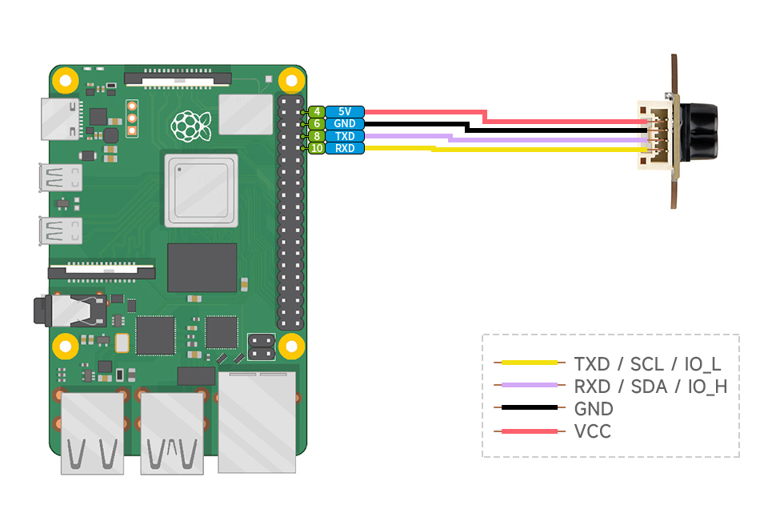

Chapter 1: linux instalation
1. Firstly, we need to gather all the equipment needed for the work: an SD card, an SD card reader (or a USB SD card adapter), a laptop, a Raspberry Pi 3B+, a USB Type-A cable, and the Sencor SKU 28761 with connector.  

2. We open sd card memory with laptop, and clear it (formatting).
 If size of sd card too small, it can mean that we have other rasberi py os, and we need to change disk structure. For it we need press right mouse button to windows shorcut. Change option "Disk Manager". In this menu we can open more settings with right clisk on sd card menu, and clear sd card.  

3.After it, we will download Raspberry Pi imager with this link https://www.raspberrypi.com/software/ 

4. After instaling imager, we need to change in Raspberry Pi imager our operation system Raspberry Pi OS Legacy 32-bit  

5. Configure system befor instaling
  Name: Maksym;
  password: 1234;
  time Helsinki
  capital Helsinki
  localization ua (but i think this option doesn't metter)
  ssh on
  Also, we need to write down our Wi-Fi settings (network name and password), because SSH will not work without them. The Raspberry Pi will use the hostname specified in the settings (for example, Maksym in my case), and we can identify it by that name.

If you do not have access to the Internet, you can use your phone's Wi-Fi hotspot. Keep in mind that some Wi-Fi networks may block SSH connections.  

6. I scanned the IP addresses using WiFiman on Android because it does not require access to your location. Some Wi-Fi scanner applications for Windows may contain malware and can be dangerous.

7. After needfull ip adress was found, we need to write command in cmd 
  ssh username@raspbery_ip_adress 
  example of command:
  ssh maksym@192.168.31.251 

8. After running the command, enter your password in console and press "Enter" on keyboard.  

9. If everything is coreect, you should see something like this:
  maksym@Maks:~ $

Chapter 2: Lidar conncetion

  
This drowing shows us wiring between SKU 28761 and the Raspberry Pi 3B+ via uart. The diagram shows a Raspberry Pi 4 Model B, but the four pins we need are located in the same positions on the Raspberry Pi 3B+.

Here, you can see the capacitor. The VCC pin is located on this side and should be connected to the +5V pin on the Raspberry Pi.
To the left of the VCC pin is the GND pin. Connect it to GND on the Raspberry Pi. Next, connect the Raspberry TX pin, followed by the RX pin, as shown in the previous image.

This sencor doesn't have led or other indicators of work, and we can to detect it's work only with code, or toching (it will be a little warm)

Also, you can read more about conections by this links: 
https://www.waveshare.com/tof-laser-range-sensor-mini.htm?srsltid=AfmBOoq7MHUcPWnI8b9-EXzjx9gurMEgyY4MUpDriKYHCVpLBbaeAQsS 

https://www.waveshare.com/wiki/TOF_Laser_Range_Sensor_Mini

Chapter 3: Reading lidar data

Serial communication parameters:

## Serial Communication Parameters

| Parameter | Value |
|-----------|-------|
| Interface | UART (TTL, 3.3 V logic) |
| Baud Rate | **921600 bps** (default) |
| Data Bits | 8 |
| Parity | None |
| Stop Bits | 1 |
| Flow Control | None |
| Byte Order | Little Endian |
| Communication Mode | UART (Active Output / Query Output) |
| Update Rate | Up to 50 Hz |

Before start of reading data, we need to configure uart. We need to turn on it and remouve Bluethoth from uart pins. 

Enter the command in the Raspberry Pi terminal: sudo raspi-config nonint do_serial
Select NO in the first pop-up window, YES in the second one, and OK for the final one.

After turning on UART, we need to check it:

maksym@Maks:~ $ `ls -l /dev/serial0`

usually, we will reciwe this result:

lrwxrwxrwx 1 root root 5 Jul 27 11:05 /dev/serial0 -> ttyS0  
ttyS0 is a mini-uart, and we need to change this status.

We should to open configs, and write target parameters in the end of this file:
maksym@Maks:~ $ sudo nano /boot/firmware/config.txt

Write this in the end of file:
enable_uart=1
dtoverlay=disable-bt
After, we need to press contrl x, and save changes (press y, anf Enter on the keyboard)

Also, we need to disable bluethoth in other way:
maksym@Maks:~ $ `sudo systemctl disable hciuart` 

And reboot system after it:
maksym@Maks:~ $ sudo reboot

Connect to our device:
ssh username@raspbery_ip_adress 
  example of command:
  ssh maksym@192.168.31.251  

Enter a password:
 example of command:
 1234  
After all, we need to create our python files with our code for reading data:
maksym@Maks:~ $ sudo nano  uart_tof_reader.py

After writing code in this file, we can start it with command:
maksym@Maks:~ $ python3 uart_tof_reader.py

Example of output: 
Дистанция: 0.657 м | Сигнал: 100 | Точность: 255 см | Статус: OK
Дистанция: 0.657 м | Сигнал: 100 | Точность: 255 см | Статус: OK
Дистанция: 0.656 м | Сигнал: 100 | Точность: 255 см | Статус: OK
Дистанция: 0.656 м | Сигнал: 100 | Точность: 255 см | Статус: OK

Chapter 4: Analyze lidar data

maksym@Maks:~ $ python3 3_option_ofSKU28761.py

In the start of program, we can change mode: 

Выберите режим работы:
  1 - Мин / макс / среднее за последние 100 измерений
  2 - Обнаружение объекта ближе 200 мм
  3 - Обнаружение объекта ближе 1.5 м
  4 - Фильтр выбросов + скользящее среднее

1. example of output:
Дистанция: 0.657 м | Окно: 94/100 | Мин: 0.656 м | Макс: 0.658 м | Среднее: 0.657 м
Дистанция: 0.657 м | Окно: 95/100 | Мин: 0.656 м | Макс: 0.658 м | Среднее: 0.657 м
Дистанция: 0.657 м | Окно: 96/100 | Мин: 0.656 м | Макс: 0.658 м | Среднее: 0.657 м

2. example of output: 
Дистанция: 0.656 м | Близко (< 200 мм): False
Дистанция: 0.657 м | Близко (< 200 мм): False
Дистанция: 0.657 м | Близко (< 200 мм): False
Дистанция: 0.656 м | Близко (< 200 мм): False

3. example of output:
UART порт /dev/serial0 открыт на скорости 921600 бод
Дистанция: 0.657 м | Скользящее среднее (1/100): 0.657 м
Дистанция: 0.657 м | Скользящее среднее (2/100): 0.657 м
Дистанция: 0.657 м | Скользящее среднее (3/100): 0.657 м
Дистанция: 0.658 м | Скользящее среднее (4/100): 0.657 м

Thank you for atention!
